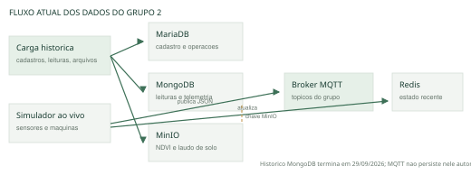
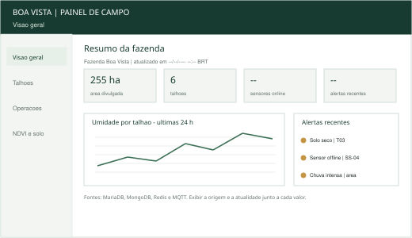
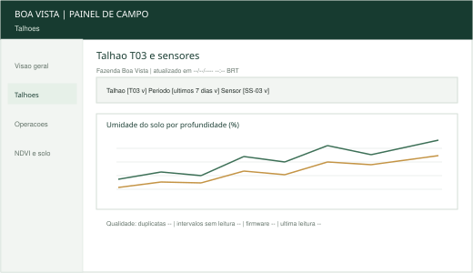
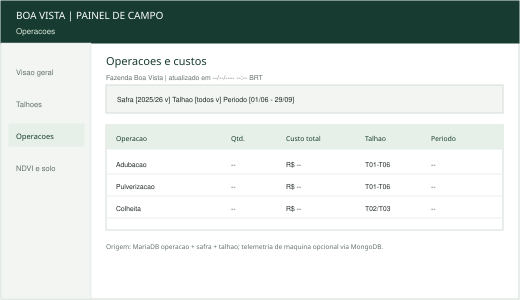
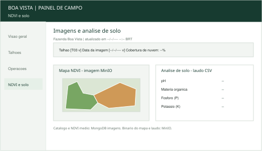
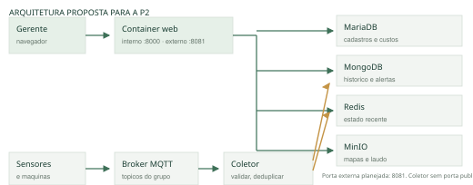

# P1 IAL214 - Estudo dos dados, arquitetura e escopo web

**Grupo 2 · Cooperativa Alta Paulista · Fazenda Boa Vista · Garça/SP**
**Projeto Integrador de Arquiteturas Cloud para Big Data · Semestre 2026.2**
**Versão de trabalho em 07/10/2026**

> **Pendências para liberar a entrega:** nomes completos e RAs dos integrantes; resultados com data/hora das consultas Q01-Q06 nos serviços reais do Grupo 2; revisão final da divisão de tarefas e da porta pública atribuída ao grupo. Este documento não preenche contagens nem defeitos por estimativa.

## 1. Grupo e fazenda

| Campo | Informação |
|---|---|
| Grupo | Grupo 2 |
| Fazenda | Fazenda Boa Vista, Garça/SP |
| Atividade agrícola | Café arábica |
| Área divulgada | 255 ha, em seis talhões |
| Integrantes | PENDENTE: nome completo e RA de cada integrante |
| Repositório GitHub | [github.com/Vitor-Studzieski/Pi-5termo](https://github.com/Vitor-Studzieski/Pi-5termo) |

O projeto propõe um painel web para apoiar o gerente da Fazenda Boa Vista no acompanhamento de sensores, alertas, operações, custos e imagens NDVI. A P1 documenta os dados disponíveis e delimita a solução a ser implementada até a P2 de 17/11/2026. O conjunto didático é sintético e cobre o período histórico de 01/06/2026 a 29/09/2026; o broker MQTT continua publicando dados ao vivo.

## 2. Estudo dos dados

O sistema distribui os dados por finalidade: MariaDB mantém cadastros e transações; MongoDB, leituras históricas e documentos de telemetria; Redis, o estado recente; MQTT, mensagens ao vivo; MinIO, arquivos. A página da disciplina publica, para o Grupo 2, 81.155 leituras de sensores, 9.200 pontos de GPS e 506 linhas SQL como referências de consistência. São números publicados, não resultados das consultas do grupo. O histórico publicado termina em 29/09/2026; eventos posteriores recebidos por MQTT não são automaticamente incorporados ao MongoDB.

| Serviço e escopo | O que guarda | Quantidade/período observado | Perguntas de negócio |
|---|---|---|---|
| MariaDB `grupo2` | Fazenda, talhões, culturas, safras, sensores, máquinas, funcionários, insumos, operações, estoque, clientes e vendas | PENDENTE Q01/Q02. Informar contagem por tabela e menor/maior data disponível. | Qual talhão/safra concentra custo? Qual foi a produtividade registrada? Como estoque e venda se relacionam às operações e safras? |
| MongoDB `grupo2.leituras` | Leituras por sensor, timestamp UTC, campos variáveis em `valores`, bateria e firmware | PENDENTE Q03. Período a partir de `ts`; referência publicada: 81.155 leituras no grupo. | Como umidade e condições meteorológicas variam por talhão e dia? Há lacunas ou anomalias? |
| MongoDB `telemetria_maquinas` | Pontos de GPS e estado de máquina ligados a `operacao_id` | PENDENTE Q03. Referência publicada: 9.200 pontos de GPS. | Onde a máquina operou e a telemetria pode ser associada a uma operação? |
| MongoDB `alertas` e `imagens` | Eventos de alerta e catálogo NDVI com talhão, data, média NDVI, nuvem e chave do objeto | PENDENTE Q03. | Quais eventos requerem atenção? Qual mapa corresponde ao talhão e data escolhidos? |
| Redis `grupo2:*` | Último valor por sensor, stream curto de leituras, 50 alertas recentes, ranking de produtividade e resumos | PENDENTE Q04. Estado transitório no momento da consulta. | Qual é a leitura mais recente? Quais alertas e talhões aparecem no estado atual? |
| MQTT `fazenda/grupo2/#` | Publicações ao vivo de sensores, máquinas, alertas e status | PENDENTE Q05. Registrar janela, instante e quantidade recebida na amostra. | O que está sendo publicado agora? Algum sensor ou máquina está online? |
| MinIO bucket `grupo2` | Imagens NDVI por talhão/data e laudo CSV de solo | PENDENTE Q06. Registrar objetos, bytes e datas. | Qual imagem ou resultado de solo pode ser consultado para um talhão? |

### Consultas e resultados

Todas as contagens a seguir ainda precisam ser executadas nos serviços do Grupo 2. As fontes de consulta estão versionadas em `docs/p1/consultas/`. Preencher o resultado com unidade, janela e horário de São Paulo depois da execução.

**Q01 - MariaDB, linhas por tabela** (`mariadb-q01-inventario.sql`):

```sql
SELECT 'fazenda' AS tabela, COUNT(*) AS linhas FROM fazenda
UNION ALL SELECT 'talhao', COUNT(*) FROM talhao
UNION ALL SELECT 'cultura', COUNT(*) FROM cultura
UNION ALL SELECT 'safra', COUNT(*) FROM safra
UNION ALL SELECT 'sensor', COUNT(*) FROM sensor
UNION ALL SELECT 'maquina', COUNT(*) FROM maquina
UNION ALL SELECT 'funcionario', COUNT(*) FROM funcionario
UNION ALL SELECT 'insumo', COUNT(*) FROM insumo
UNION ALL SELECT 'operacao', COUNT(*) FROM operacao
UNION ALL SELECT 'estoque_movimento', COUNT(*) FROM estoque_movimento
UNION ALL SELECT 'cliente', COUNT(*) FROM cliente
UNION ALL SELECT 'venda', COUNT(*) FROM venda;
```

**Q02 - MariaDB, custo e produtividade** (`mariadb-q02-operacoes.sql`):

```sql
SELECT tipo, COUNT(*) AS quantidade,
       ROUND(SUM(custo_total), 2) AS custo_total
FROM operacao GROUP BY tipo ORDER BY custo_total DESC;
```

**Q03 - MongoDB, contagem e cobertura histórica** (`mongodb-q03-inventario.js`):

```javascript
for (const nome of ["leituras", "telemetria_maquinas", "alertas", "imagens"]) {
  const c = db.getCollection(nome);
  printjson({colecao: nome, documentos: c.countDocuments({}),
    cobertura_utc: c.aggregate([{$group: {_id: null,
      primeiro: {$min: "$ts"}, ultimo: {$max: "$ts"}}}]).toArray()});
}
```

**Q04 - Redis, chaves e janela recente** (`redis-q04-estado.txt`):

```text
SCAN 0 MATCH grupo2:* COUNT 100
HGETALL grupo2:sensor:SS-01
XREVRANGE grupo2:stream:leituras + - COUNT 5
LRANGE grupo2:alertas:recentes 0 9
ZREVRANGE grupo2:ranking:produtividade:2025-26 0 -1 WITHSCORES
```

**Q05 - MQTT, amostra ao vivo** (`mqtt-q05-amostra.sh`):

```sh
mosquitto_sub -h "$MQTT_HOST" -p "$MQTT_PORT" \
  -u "$MQTT_USERNAME" -P "$MQTT_PASSWORD" \
  -t 'fazenda/grupo2/#' -v -C 20 -W 30
```

**Q06 - MinIO, objetos do bucket** (`minio-q06-inventario.py`):

```python
for obj in s3.list_objects_v2(Bucket="grupo2").get("Contents", []):
    print(obj["Key"], obj["Size"], obj["LastModified"])
```

| Consulta | Execução (horário de São Paulo) | Resultado observado | Interpretação |
|---|---|---|---|
| Q01 | PENDENTE | PENDENTE | Sem execução autenticada; não inferir distribuição por tabela a partir do total agregado publicado. |
| Q02 | PENDENTE | PENDENTE | O custo só poderá ser comparado depois de confirmar unidades, campos nulos e janela da safra. |
| Q03 | PENDENTE | PENDENTE | Os limites UTC devem ser convertidos ao fuso local para relatórios diários. |
| Q04 | PENDENTE | PENDENTE | Redis representa estado recente e uma janela curta, não substitui o histórico. |
| Q05 | PENDENTE | PENDENTE | Uma amostra do broker é transitória e não mede cobertura histórica. |
| Q06 | PENDENTE | PENDENTE | Registrar total de objetos/bytes e conferir se as chaves esperadas abrem. |

## 3. Qualidade dos dados

A documentação do conjunto informa que foram incluídos exemplos de duplicatas, intervalos sem leitura, valores impossíveis, sensores repetindo valores, alterações de unidade após mudança de firmware e documentos fora da ordem temporal. A documentação não localiza os casos em cada fazenda. A tabela abaixo registra como o grupo vai detectá-los e tratá-los; as quantidades da Fazenda Boa Vista são PENDENTES até executar Q04.

| Problema e detecção | Quantidade afetada | Tratamento planejado |
|---|---|---|
| Duplicata: mesma chave lógica `(sensor, ts)` no MongoDB. Q04 agrupa a chave e conta linhas excedentes. | PENDENTE Q04 | Deduplicar idempotentemente pela chave lógica ao ingerir; não contar duplicatas em médias. Manter trilha de auditoria. |
| Lacuna: intervalo entre duas leituras do mesmo sensor acima da cadência nominal histórica de 15 min. Q04 ordena por `ts` UTC e estima slots ausentes. | PENDENTE Q04 | Mostrar lacuna e intervalo sem dado; não interpolar silenciosamente. |
| Percentual impossível: umidade percentual ou bateria menor que 0 ou maior que 100. Q04 filtra os campos. | PENDENTE Q04 | Excluir da agregação e dos alertas numéricos; preservar o valor bruto com indicador de qualidade. |
| Sensor possivelmente travado: oito ou mais valores consecutivos iguais no mesmo sensor. Q04 faz triagem com base na cadência de 15 min. | PENDENTE Q04 | Sinalizar para análise; confirmar com status e firmware antes de excluir. O limiar é triagem, não prova de defeito. |
| Unidade/firmware: distribuição de versão e escala dos valores por sensor/período. Q03/Q04 comparam firmware e campos numéricos. | PENDENTE Q03/Q04 | Converter para unidade canônica somente após confirmar a mudança; guardar unidade original e regra de conversão. |
| Ordem de chegada distinta da ordem do evento: comparar sequência natural e `ts`. | PENDENTE Q04 | Ordenar por hora do evento, aceitar atrasos e tornar a gravação idempotente. |
| Telemetria sem operação associada: comparar `operacao_id` MongoDB com `operacao.id` MariaDB. | PENDENTE após consultas | Exibir com aviso e deixar fora de métricas por operação até revisar a referência. |

Os limiares de triagem serão revistos com o cadastro e o firmware do sensor. O sistema manterá visível a diferença entre “sem leitura” e “leitura válida sem alteração”. Nenhuma limpeza será aplicada diretamente ao conjunto compartilhado da disciplina.

## 4. Arquitetura atual

O conjunto histórico é carregado nos serviços gerenciados da disciplina. No fluxo contínuo, o simulador publica mensagens no broker MQTT e atualiza o Redis. O broker também entrega as mensagens aos assinantes; a mensagem MQTT não se torna automaticamente um documento histórico do MongoDB. A consulta da página da disciplina indica que o stream Redis guarda aproximadamente as últimas 5.000 leituras e que as estruturas recentes são uma visão de curta duração.



O MariaDB guarda cadastros e relações que exigem integridade; MongoDB suporta documentos de sensores e telemetria com campos variáveis e consultas por tempo; Redis atende leitura rápida do estado recente; MQTT desacopla publicação e assinatura do fluxo; MinIO guarda arquivos binários sem inflar os bancos transacionais. O catálogo de imagens fica no MongoDB e referencia a chave de objeto no MinIO. O diagrama editável Mermaid está em `arquitetura/atual.mmd`.

## 5. Escopo do sistema web

### Problema e persona

**Persona principal - gerente da Fazenda Boa Vista:** precisa verificar a condição dos seis talhões, reconhecer rapidamente quando a leitura está desatualizada ou suspeita, investigar alertas e relacionar a operação de campo a custos, telemetria, análise de solo e imagens NDVI. O painel reduz a troca entre ferramentas e deixa explícita a origem e a atualidade de cada informação.

### Requisitos funcionais

- RF01. Exibir resumo da fazenda, talhões, última leitura disponível, chuva/umidade disponível e data/hora da atualização.
- RF02. Permitir selecionar talhão e período para consultar leituras históricas por sensor.
- RF03. Exibir alertas recentes e indicar severidade, sensor/talhão e horário do evento.
- RF04. Consultar operações e custos agregados por tipo, talhão e safra.
- RF05. Abrir mapas NDVI e laudo de solo pelo catálogo e pela chave de objeto correspondente.
- RF06. Distinguir dado histórico, estado Redis e evento MQTT ao vivo; exibir atraso, ausência e qualidade da leitura.
- RF07. Disponibilizar indicação de saúde das conexões e horário da última atualização por serviço.

### Requisitos não funcionais

- RNF01. Credenciais permanecem no servidor/coletor; navegador recebe somente dados necessários à tela.
- RNF02. Usuário do banco tem privilégio mínimo; conexões externas usam TLS quando o serviço disponibilizar.
- RNF03. Tela principal responde em até 3 s para consultas típicas sob carga de laboratório (meta a validar; filtros e limites de período obrigatórios).
- RNF04. O painel degrada com mensagem clara se MQTT, Redis ou um banco estiver indisponível; falha de um serviço não bloqueia telas independentes.
- RNF05. Dados históricos são consultados em leitura; gravações ficam limitadas à persistência idempotente de novas mensagens pelo coletor, se aprovada na P2.
- RNF06. Layout responsivo e contraste legível em desktop/notebook; datas exibidas em `America/Sao_Paulo`, armazenadas/intercambiadas em UTC.

### Wireframes

Os traçados e valores de exemplo nos wireframes são ilustrativos e não representam medições nem alertas observados na Fazenda Boa Vista.









| Tela | Informação exibida | Origem |
|---|---|---|
| Visão geral | Nome, área, talhões, cultura e safra | MariaDB `fazenda`, `talhao`, `cultura`, `safra`; Redis `grupo2:fazenda`, `grupo2:talhao:*` para resumo recente |
| Visão geral | Última leitura e estado atual | Redis `grupo2:sensor:<codigo>`; se assinada, tópico MQTT `fazenda/grupo2/sensores/<SENSOR>`; status `fazenda/grupo2/status` |
| Visão geral | Alertas recentes | Redis `grupo2:alertas:recentes`; confirmação/histórico em MongoDB `alertas` |
| Talhão e sensores | Série histórica, umidade, temperatura, bateria, firmware | MongoDB `leituras`, filtrado por `sensor`, `talhao` e `ts`; cadastros MariaDB `sensor`, `talhao` |
| Operações e custos | Tipo, data, custo, funcionário, máquina, insumo e safra | MariaDB `operacao`, `funcionario`, `maquina`, `insumo`, `safra`, `talhao` |
| Operações e custos | Percurso/telemetria ligada à operação | MongoDB `telemetria_maquinas` por `operacao_id`; cadastro MariaDB `maquina` |
| NDVI e solo | Datas, NDVI médio, nuvem, caminho do objeto | MongoDB `imagens`; imagens em MinIO `grupo2/ndvi/<talhao>/<data>.png` |
| NDVI e solo | pH, matéria orgânica, nutrientes e profundidade | MinIO `grupo2/laudos/analise_solo_2026.csv`; metadados de talhão em MariaDB |

## 6. Arquitetura proposta e plano

### Decisão de arquitetura

Propomos um **monólito web modular**, acompanhado por um **container coletor MQTT** pequeno e independente. Com quatro integrantes e seis semanas até a P2, o monólito reduz o custo de deploy e de integração das telas; módulos internos isolam domínio, consultas e adaptadores. O coletor fica separado porque tem ciclo contínuo de consumo, reconexão e gravação, diferente do ciclo de requisição da interface. Essa divisão evita decompor cada função de tela em um serviço próprio.

O coletor assina `fazenda/grupo2/#`, valida esquema, sensor e timestamp, registra eventos tardios com a hora do evento e usa `(tópico, sensor, timestamp)` como chave idempotente. A proposta é gravar novas leituras aceitas em MongoDB e atualizar o estado recente em Redis. QoS 1, reconexão com backoff e confirmação somente após persistência reduzem perda; deduplicação cobre reentrega. A política de retenção, armazenamento de payload inválido e autorização de persistência devem ser confirmadas antes da implementação.



### Containers, portas e credenciais

| Container | Função | Rede/porta planejada |
|---|---|---|
| `web` | Interface e API do monólito modular; conecta aos bancos no servidor | Porta interna 8000; porta pública atribuída ao grupo: PENDENTE. Não expõe credenciais ao navegador. |
| `mqtt-coletor` | Assina tópicos do Grupo 2, valida mensagens e persiste as novas leituras | Sem porta pública; conexões de saída ao MQTT, MongoDB e Redis. |
| Serviços gerenciados da disciplina | MariaDB, MongoDB, Redis, MQTT e MinIO | Não recriar nem publicar containers locais desses serviços para a aplicação do grupo. |

Credenciais entram como variáveis de ambiente no deploy pelo painel de containers. `.env.example` contém somente nomes e valores demonstrativos; `.env` permanece local/ignorado. O servidor recebe `MARIADB_*`, `MONGODB_URI`, `REDIS_URL`, `MINIO_*`; o coletor recebe `MQTT_*`, `MONGODB_URI` e `REDIS_URL`. Nenhum segredo vai para imagem, Git, log, HTML ou JavaScript do navegador. Os usuários dos serviços devem ter acesso restrito ao `grupo2`.

### Cronograma até a P2

| Período | Entrega intermediária |
|---|---|
| 08-11/10 | Medir consultas, fechar inventário, confirmar qualidade e registrar decisões. |
| 12-18/10 | Esqueleto do monólito, adaptadores read-only, navegação e credenciais de ambiente. |
| 19-25/10 | Implementar visão geral e tela de talhão; validar consultas históricas e datas/fuso. |
| 26/10-01/11 | Operações/custos, NDVI/laudo e rastreabilidade da tela às fontes. |
| 02-08/11 | Coletor MQTT, idempotência, estado Redis e tratamento de indisponibilidade/atraso. |
| 09-15/11 | Integração, revisão de qualidade, deploy de containers e roteiro/evidências de demonstração. |
| 16-17/11 | Correções finais, congelamento da versão, PDF/relatório final e entrega da P2. |

### Divisão de tarefas

| Integrante | Responsabilidade proposta | Confirmação |
|---|---|---|
| Integrante 1 - PENDENTE: nome/RA | Coordenação, consultas MariaDB, dados de custo e produtividade | PENDENTE |
| Integrante 2 - PENDENTE: nome/RA | Consultas MongoDB, análise de qualidade e adaptador histórico | PENDENTE |
| Integrante 3 - PENDENTE: nome/RA | Wireframes/UI e consultas Redis/MQTT | PENDENTE |
| Integrante 4 - PENDENTE: nome/RA | Containerização, MinIO, deploy e operação | PENDENTE |

As atribuições são uma proposta inicial, não uma ata de acordo. O grupo deve associar as tarefas às pessoas e revisar a carga antes da implementação. A arquitetura editável está em `arquitetura/proposta.mmd`; a decisão e suas consequências estão em `../decisoes/ADR-001-arquitetura.md`.

### Referências

- Atividade P1 IAL214: https://lapps.studio/disciplinas/projeto-integrador-arquiteturas-cloud/atividades/p1-estudo-dados-escopo/
- Conjunto de dados IAL214: https://lapps.studio/disciplinas/projeto-integrador-arquiteturas-cloud/dados/
- Guia de organização deste repositório: `../../instrucoes.md`.
